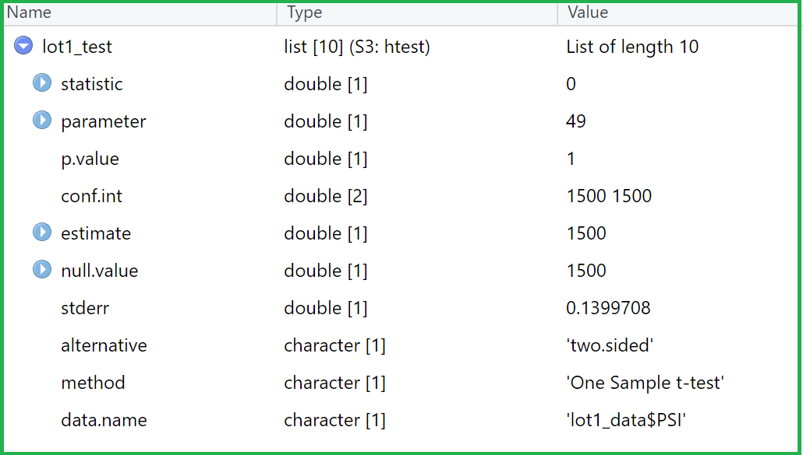

# MechaCar_Statistical_Analysis

## Linear Regression to Predict MPG

-   **Which variables/coefficients provided a non-random amount of variance to the mpg values in the dataset?**

Intercept, Vehicle_length, ground_clearance variables have provided a non-random amount of variance to the mpg values in the dataset.

-   **Is the slope of the linear model considered to be zero? Why or why not?**

The p-value of our linear regression analysis is 5.35e-11, which is much smaller than our assumed significance level of 0.05. Therefore, we
can state that there is sufficient evidence to reject our null hypothesis, which means that the slope of our linear model is not zero.

-   **Does this linear model predict mpg of MechaCar prototypes effectively? Why or why not?**

According to the summary output, the r-squared value is 0.71 in our multiple linear regression model while the p-value significant, which means
it predicts mpg of
MechaCar prototypes effectively.

## Summary Statistics on Suspension Coils

-   The current manufacturing data meet the design specification for all manufacturing lots in total but not for each lot individually as the
variance of the suspension coils exceeds 100 pounds per square inch for `Lot3`.

## T-Tests on Suspension Coils

-   **All lot interpretation and findings for t-test result**
The p-value from the test result is 0.060. Assuming the significance level was 0.05 percent, the p-value is above the significance level. Therefore,
there is not enough evidence to reject the null hypothesis and we can affirm that all the samples and the population data is statistically similar.

-   **Lot1 interpretation and findings for t-test result**
The p-value for lot1 is 1. Assuming the significance level was 0.05 percent, the p-value is above the significance level. Therefore, there is not
enough evidence to reject the null hypothesis and we can affirm that the lot1 sample and the population data are statistically similar.

-   **Lot2 interpretation and findings for t-test result**
The p-value for lot2 is 0.060. Assuming the significance level was 0.05 percent, the p-value is above the significance level. Therefore, we don't
have sufficient evidence to reject the null hypothesis, and we can affirm that the two means are statistically similar.

-   **Lot3 interpretation and findings for t-test result**
The p-value for lot3 is 0.041. Assuming the significance level was 0.05 percent, the p-value is below the significance level. Therefore, we have
sufficient evidence to reject the null hypothesis, and we can affirm that the two means are statistically different.

## Study Design: MechaCar vs Competition

The most important metric to compare performance of Mechacar with other manufacturers is mpg. Furthermore, we can compare mechacar's mpg with other
manufacturers based on various groups such as:

1. Groups based on length of vehicle.
2. Groups based on vehicle weight.
3. Groups based on value of AWD.

We will need this mpg data for mechacar and other manufacturers with the above segments to perform the analysis.

To compare the metrics, we can use paired t-test to identify whether average mpg of mechacar is statistically similar to average mpg of other
manufacturers. We can define the NULL hypothesis for the paired t-test as the difference between the data values of mpg across manufacturers
should be 0. The alternative hypothesis for paired t-test will be that the difference between the data values of mpg across manufacturers should not be 0. 

As the result of paired t-test, we will obtain the p-value. We can compare this p value with significance value of 0.05 to determine the result of NULL
hypothesis. If the p-value is greater than 0.05, which means it is greater than the significance level. So, we cannot reject the NULL hypothesis which in
this case would mean that the average mps values across manufacturers is similar. In this case, since the means are similar, we should conduct an ANOVA test
to see if the variance of the mpg values also differs or are similar. This will help us ascertain if the mpg values follow the same distribution statistically
or not. 

If the p-value is smaller than 0.05, it would mean that the alternative hypothesis is true and that the mean values of mpg is not similar. We can then
compare the mean mpgs across various segments like different length cars, different weight cars and AWD or non-AWD cars to see if Mechacar's mpg values
fare better or worse than the other manufacturer cars.
